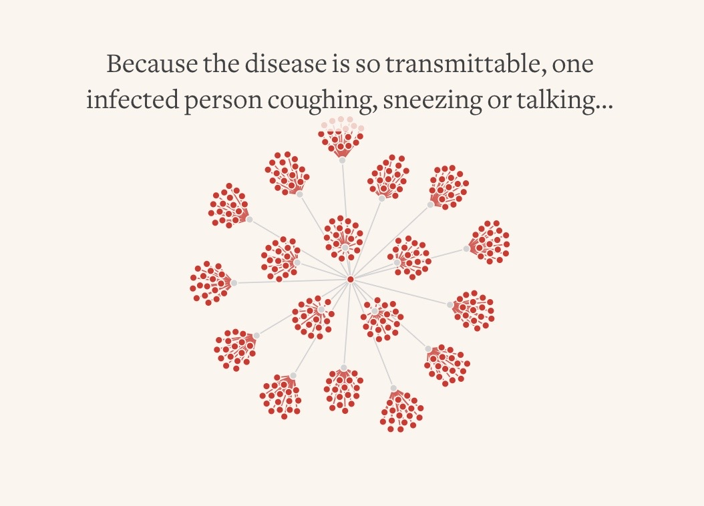
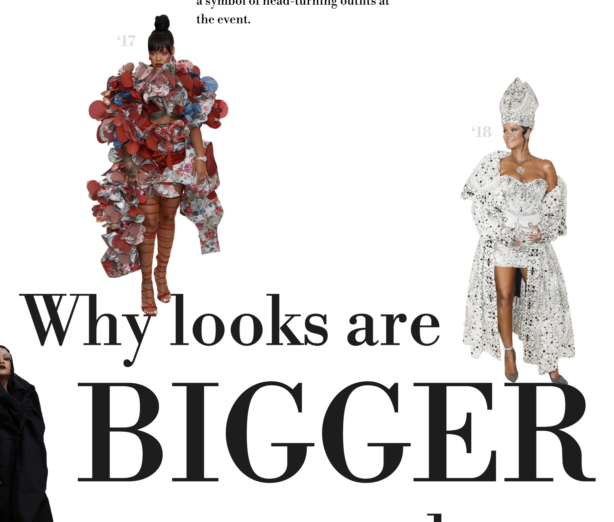
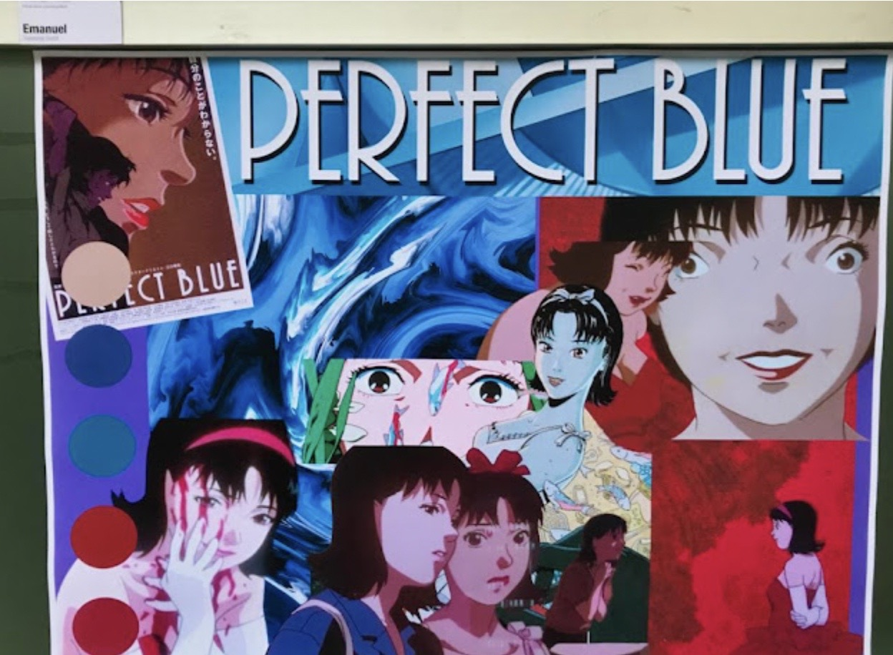
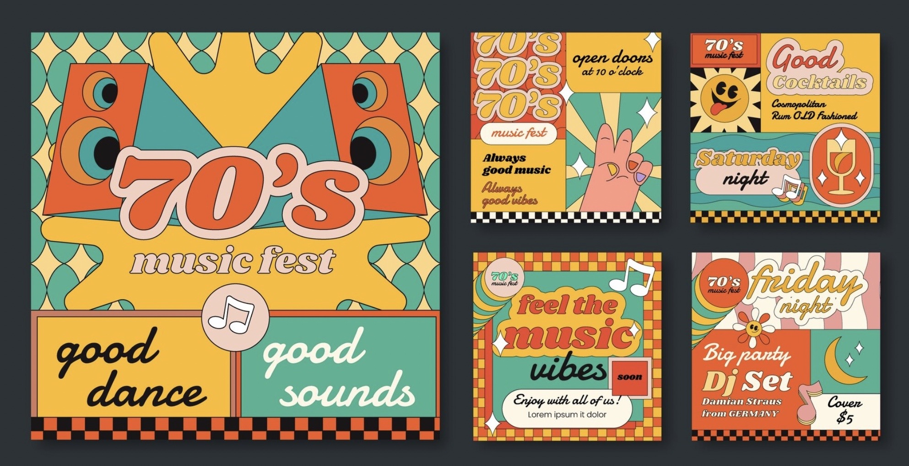
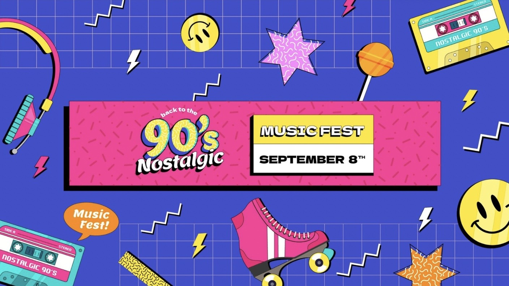

# Proyecto de Visualización de Datos:

## Premios Oscar — evolución de los géneros ganadores por década

Este proyecto analiza la evolución de los géneros cinematográficos que han ganado el premio a Mejor Película en los Premios Oscar, abordando la información por décadas, desde los años 1930 hasta la actualidad.
El objetivo es representar visualmente cómo las preferencias de la Academia han cambiado a lo largo del tiempo, y cómo estos cambios pueden estar relacionados con contextos sociopolíticos, tendencias culturales y momentos históricos clave.

La propuesta busca comunicar de forma efectiva mediante el diseño visual, resaltando patrones, rupturas y permanencias. Se incorporarán referencias visuales típicas de cada década (como íconos culturales, moda, estilos gráficos o música)

## Fuentes de datos

- **[Statista]**: [https://es.statista.com/estadisticas/679457/peliculas-ganadoras-en-los-premios-oscar/]
- **[Filmafiffinity]**: [https://www.filmaffinity.com/cl/awards3.php?award_id=academy_awards&decade=2020]
- **[Epdata]**: [https://www.filmaffinity.com/cl/awards3.php?award_id=academy_awards&decade=2020]
- **[Wikipedia]**: https://es.wikipedia.org/wiki/Anexo:%C3%93scar_a_la_mejor_pel%C3%ADculaEnlaces a un sitio externo.

## Referencias de diseño e inspiración
### 📚 Tabla de referencias visuales y conceptuales
### 📚 Tabla de referencias visuales y conceptuales
| Imagen | Fuente | Tipo de referencia | Enlace | Aspectos positivos | Aspectos negativos |
|--------|--------|---------------------|--------|---------------------|---------------------|
|  | Reuters Graphics | Visualizaciones interactivas | [Ver enlace](https://reuters.com) | – Interactividad clara   – Codificación visual efectiva   – Línea de tiempo útil | – Carencia de contexto cultural   – Poco evocativa estéticamente |
|  | Reuters Graphics | Uso de collage editorial | [Ver enlace](https://reuters.com) | – Enfoque narrativo   – Diseño visual llamativo   – Uso de íconos culturales | – No es interactivo   – Carga visual puede distraer del contenido |
|  | Blog UGD | Moodboards cinematográficos | [Ver enlace](https://blogugd.blogspot.com/2023/03/exposicion-moodboards-cinematograficos.html) | – Representación visual evocadora   – Relación directa con géneros y estéticas   – Ideal para collage por década | – No interactivo   – Estilo amateur o académico |
|  | Freepik (70s) | Inspiración estética (década) | [Ver enlace](https://www.freepik.com) | – Gran variedad de recursos   – Representación estética útil por década | – No contextualiza   – Riesgo de cliché visual |
|  | Freepik (90s) | Inspiración estética (década) | [Ver enlace](https://www.freepik.com) | – Imágenes vibrantes y representativas   – Rápido acceso a referentes visuales | – Estética sobrecargada   – No es una fuente editorial validada |
|  | The Best of the 80s (Blog) | Collage cultural de época | [Ver enlace](https://thebestofthe80s.wordpress.com/2014/02/15/80s/) | – Íconos culturales y visuales auténticos   – Buena evocación de la estética ochentera | – Blog personal   – Puede tener referencias no verificadas |

## 📌 Recursos útiles

Para editar este `README.md` utilicé las siguientes guías y hojas de ayuda:

- [Markdown Guide – Cheat Sheet](https://www.markdownguide.org/cheat-sheet/)
- [GitHub Markdown Cheatsheet](https://github.com/adam-p/markdown-here/wiki/Markdown-Cheatsheet)
- [Datacamp Markdown Cheatsheet (PDF)](https://www.datacamp.com/cheat-sheet/markdown-cheat-sheet-23)

